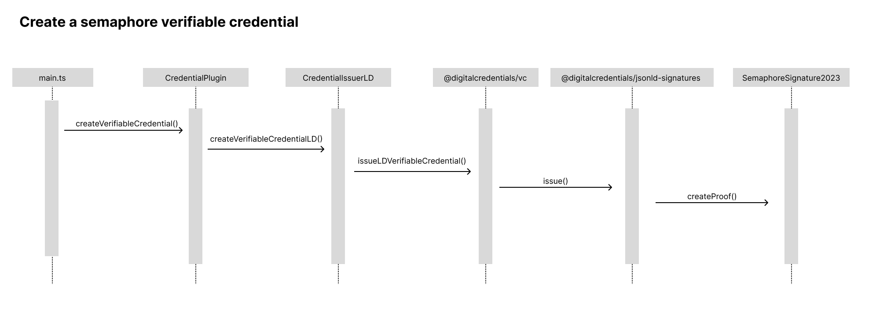

# veramo-credential-ld-semaphore

## Introduction

`veramo-credential-ld-semaphore` aims to facilitate a comprehensive review of the integration between [Semaphore](https://semaphore.pse.dev/), a zero-knowledge proof framework, and W3C-related standards such as Decentralized Identifiers (DIDs) and Verifiable Credentials. Initially developed as part of the [tw-did](https://github.com/tw-did/tw-did) project, this repository extracts the code related to Semaphore and Veramo integration for a more focused evaluation.

This project leverages the [Veramo](https://veramo.io/) package, specifically [@veramo/credential-ld](https://www.npmjs.com/package/@veramo/credential-ld), to expand the JSON-LD format with custom encryption algorithms. Our integration focuses on two main classes: `SemaphoreSignature2023` and `SemaphoreKeyManagementSystem`.

## Background

We are bridging Semaphore and W3C standards by using the Veramo framework. Veramo offers a modular approach to conform to W3C standards, such as DIDs and Verifiable Credentials. Our integration is implemented via the `@veramo/credential-ld` package, which allows for the extension of Verifiable Credentials in JSON-LD format.

## How It Works

### Main Components

- **SemaphoreSignature2023**: This class is responsible for generating and verifying proofs. It extends the `VeramoLdSignature` interface from Veramo to integrate Semaphore functionality.

- **SemaphoreKeyManagementSystem**: This class is used for storing relevant information concerning Semaphore.

### Workflow

When a user invokes `agent.createVerifiableCredential()` and sets `proofFormat` to `lds`, Veramo calls `SemaphoreSignature2023` via `CredentialIssuerLD` and the corresponding algorithm name to generate and verify proofs.

## Getting Started

In this example, a Semaphore identity has already been added to a Semaphore group. You can generate and verify proofs through a series of function calls.

Firstly, make sure to install the required packages by running:

```bash
npm install
```

You can then perform the following actions by running `npm start`:

- **`new Identity()`**: Generate a new Semaphore identity.
- **`agent.didManagerImport()`**: Import the generated identity into Veramo as a hidden identity.
- **`agent.createVerifiableCredential()`**: Generate a proof that a specific identity belongs to a particular Semaphore group.
- **`agent.verifyCredential()`**: Verify the proof generated in the previous step.

This set of functions will guide you through the process of generating and verifying proofs in a Semaphore group using Veramo's functionalities.

## Create a Semaphore credential

When the `agent.createVerifiableCredential()` function is called, it actually passes through a complex chain of packages before ultimately reaching `SemaphoreSignature2023.createProof()`. The flow of function calls goes through the following packages in sequence:

1. `agent`
2. `@veramo/credential-w3c`
3. `@veramo/credential-ld`
4. `@digitalcredentials/vc`
5. `@digitalcredentials/jsonld-signatures`



### Known Issue and Future Work

During this extensive workflow, a limitation was encountered: the `@digitalcredentials/vc` package seems to support only Node.js environments, lacking browser compatibility. However, it's important to note that this example does not include the re-implemented `credential-ld` from the `tw-did` project, as the sample code provided here runs only in a Node.js environment, not in a browser.

## Hidden Identity: Using `did:web` for Anonymity

In this project, we leverage a DID (Decentralized Identifier) method known as `did:web` to serve as a hidden identity marker. Since Semaphore's goal is to prove membership within a group without revealing one's identity, having a hidden identifier becomes crucial.

This special identifier is hosted at [tw-did/hidden](https://github.com/tw-did/hidden) and can be accessed using the DID URI `did:web:tw-did.github.io:hidden`. The `publicKeyHex` of this identifier is set to "00000000000000", allowing anyone to use it as a hidden identity marker.

We chose `did:web` for its flexibility in adding custom algorithms, like our `Semaphore2023`. In contrast, methods like `did:key` or `did:ethr` require more effort to adapt new algorithms, making `did:web` a more time-efficient choice for our project.

### Example Usage

In your `main.ts` file, you can import this hidden identity as follows:

```typescript
// create mock sempahore identity
const identity = new Identity('TOP-SECRET-KEY');

// import the identity but use hidden publicKeyHex
const holder = await agent.didManagerImport({
  did: 'did:web:tw-did.github.io:hidden',
  provider: 'did:web',
  keys: [
    {
      kid: 'default',
      kms: SEMAPHORE_KMS,
      type: SEMAPHORE_TYPE,
      privateKeyHex: identity.toString(),
      publicKeyHex: SEMAPHORE_HIDDEN_PUBLIC_KEY,
    },
  ],
});
```

In this code snippet, `privateKeyHex` contains the actual secret identifier, while `publicKeyHex` is filled with the constant `SEMAPHORE_HIDDEN_PUBLIC_KEY`, which corresponds to "00000000000000". When `agent.createVerifiableCredential()` is called, `@veramo/credential-ld` will search for the matching key using this `publicKeyHex`, allowing the imported key to be identified and used for generating the credential.
